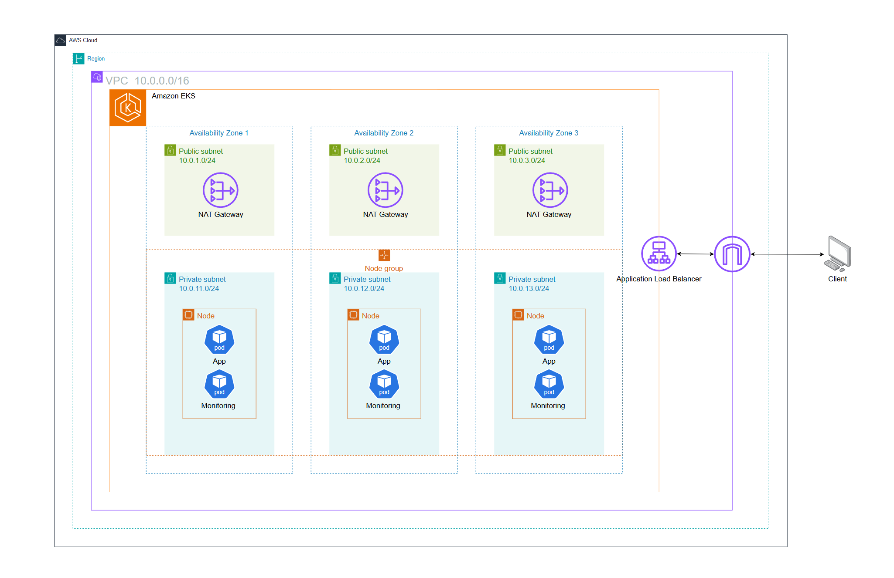

# Terraform AWS EKS Observability Infrastructure

## 1. Overview
This project provisions a **highly available Amazon EKS cluster** using **Terraform**, designed as a foundation for deploying **microservices** and an **observability stack**.

The infrastructure consists of:
- **VPC** with private and public subnets distributed across multiple Availability Zones.
- **EKS Cluster** for running containerized workloads.
- **ALB Controller** for ingress traffic management.
- **Route53 & ACM** for domain management and TLS certificates.
- **Security Groups** following the principle of least privilege.
- **IRSA (IAM Roles for Service Accounts)** to securely bind observability tools with AWS services.

This setup provides a **modular, secure, and production-ready environment** for cloud-native workloads.

---

## 2. Cloud Infrastructure Diagram



---

## 3. Infrastructure Details

### Security Groups

| **Security Group**         | **Ingress Rules**                                                                                               | **Egress Rules**                 |
|-----------------------------|-----------------------------------------------------------------------------------------------------------------|----------------------------------|
| **Public Access**           | - TCP `80/443` from `0.0.0.0/0` (HTTP/HTTPS)                                                                    | Allow all outbound traffic       |
| **EKS Nodes**               | - TCP `443` from Public Subnet (API access)<br>- TCP/UDP `10250` from Node Group (Kubelet)<br>- Custom app ports | Allow all outbound traffic       |
| **Observability**           | - TCP `3000` (Grafana), `9090` (Prometheus), `3100` (Loki), `3200` (Tempo), `5665` (Icinga2) from VPC subnets    | Allow all outbound traffic       |
| **Database/Storage**        | - TCP `5432` (Postgres)<br>- TCP `9000` (MinIO/S3 API) from EKS & Observability Subnets                          | Restricted to internal subnets   |

---

### EKS Cluster
- **Control Plane**: Managed by AWS (multi-AZ, fault-tolerant).
- **Node Groups**: Deployed across multiple Availability Zones for high availability.
- **IRSA**: Provides fine-grained IAM roles for Prometheus, Grafana, Loki, and other observability tools.
- **Scaling**: Supports both Horizontal Pod Autoscaler (HPA) and Cluster Autoscaler.

---

### Networking
- **VPC**: Custom CIDR block (e.g., `10.0.0.0/16`).
- **Subnets**: Public and private subnets across 2–3 Availability Zones.
- **Internet Gateway (IGW)**: Enables outbound Internet access for public resources.
- **NAT Gateway**: Allows private nodes to pull images and updates securely.

---

### Route53 & ACM
- **DNS**: Managed via Route53.
- **TLS Certificates**: Automated provisioning using AWS Certificate Manager (ACM).
- **Ingress**: ALB Ingress Controller integrates with Route53 for domain-based routing.

---

## 4. Deployment

### Terraform Commands
```bash
terraform init
terraform plan -var-file="terraform.tfvars"
terraform apply -var-file="terraform.tfvars" -auto-approve
```

<details>
<summary>🔽 View more deployment details</summary>

### Prerequisites
- Terraform ≥ 1.5  
- AWS CLI configured (`aws configure`)  
- kubectl, Helm  
- AWS account with required quotas  
- Optional: Route53 domain

---

### Configure terraform.tfvars
Example configuration:
```hcl
project_name = "eks-obser"
region       = "ap-southeast-1"
azs          = ["ap-southeast-1a", "ap-southeast-1b"]

vpc_cidr             = "10.0.0.0/16"
public_subnet_cidrs  = ["10.0.1.0/24", "10.0.2.0/24"]
private_subnet_cidrs = ["10.0.11.0/24", "10.0.12.0/24"]

eks_cluster_version = "1.30"
node_instance_types = ["t3.large"]
node_desired_size   = 2
node_min_size       = 2
node_max_size       = 5
```

---

### Connect kubectl
```bash
aws eks update-kubeconfig --name "<cluster_name>" --region "<region>"
kubectl get nodes
```

---

### (Optional) Install Observability Stack
Using Helm charts:
```bash
helm repo add prometheus-community https://prometheus-community.github.io/helm-charts
helm install kube-prometheus-stack prometheus-community/kube-prometheus-stack -n observability --create-namespace
```

Similar for Loki, Tempo, Grafana.

---

### (Optional) Expose via ALB Ingress
```yaml
apiVersion: networking.k8s.io/v1
kind: Ingress
metadata:
  name: app
  annotations:
    kubernetes.io/ingress.class: alb
spec:
  rules:
    - host: app.example.com
      http:
        paths:
          - path: /
            pathType: Prefix
            backend:
              service:
                name: my-service
                port:
                  number: 80
```

---

### Destroy
```bash
terraform destroy -var-file="terraform.tfvars"
```

</details>

---

## 5. Deployment & Testing

### Terraform Commands
```bash
terraform init
terraform plan -var-file="terraform.tfvars"
terraform apply -var-file="terraform.tfvars" -auto-approve
```

---

### Terratest (Infrastructure Testing)

We provide two testing modes:

<details>
<summary>🔽 Unit Test (Plan only – no cost)</summary>

This mode validates that the Terraform **plan** includes all key modules and resources  
(VPC, Subnets, EKS, ALB, Route53, IRSA, Security Groups) **without creating real AWS resources**.

Run:
```bash
cd terratest
go test -v plan_test.go -timeout 30m
```

✅ Safe to run anytime, no AWS cost.

---
</details>

<details>
<summary>🔽 Integration Test (Apply – creates real AWS resources, incurs cost)</summary>

This mode applies the Terraform code, checks outputs against AWS (via AWS CLI),  
and destroys everything at the end of the test.

Run:
```bash
cd terratest
go test -v apply_test.go -timeout 60m
```

⚠️ **Warning**: This will create real AWS resources (EKS, NAT Gateway, ALB, Route53, etc.) and will incur cost. Always run `terraform destroy` after tests.

---
</details>

---

## 6. Conclusion
This AWS EKS infrastructure provides a **secure, modular, and scalable foundation** for modern cloud applications.  
It is optimized for deploying **microservices** together with an **observability stack** (Prometheus, Grafana, Loki, Tempo, Icinga2).  

The design focuses on infrastructure automation, high availability, and production readiness.  
Higher-level workloads (applications and monitoring tools) can be deployed seamlessly on top of this environment.
 
